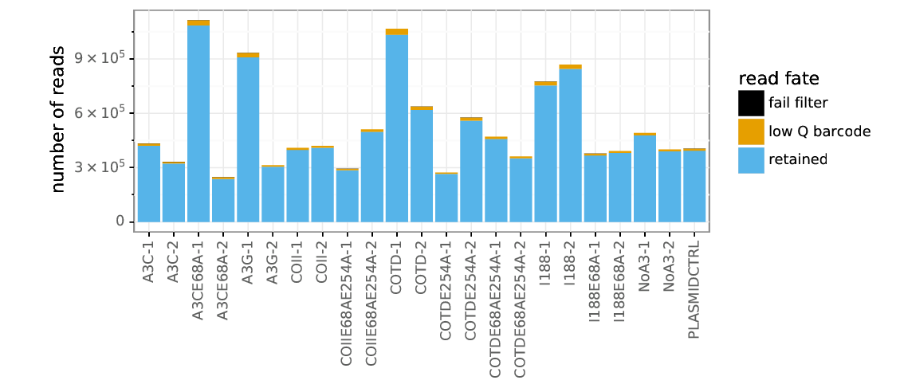
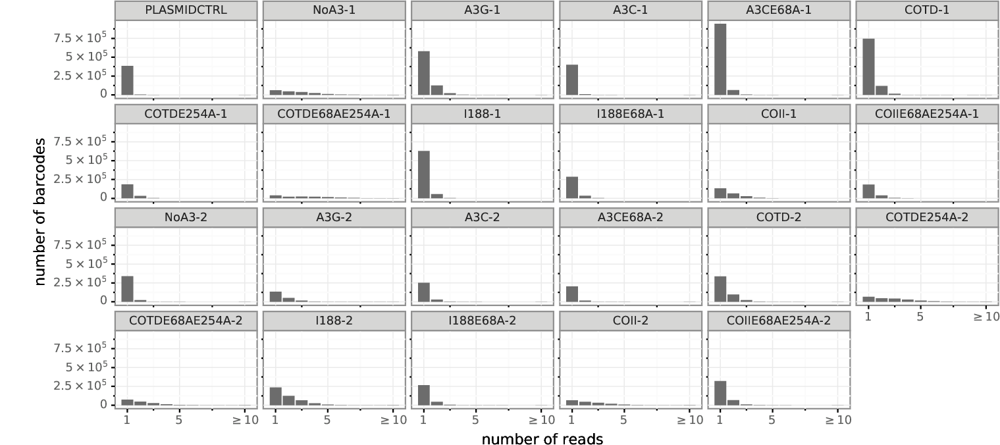
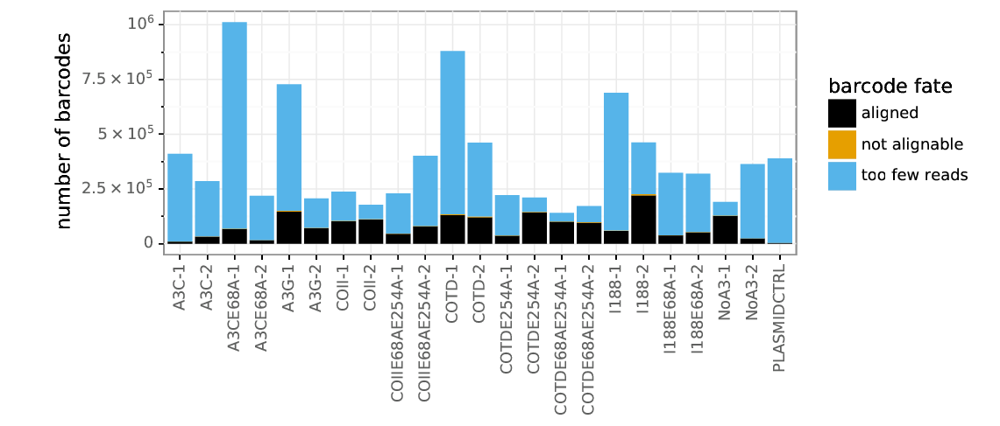
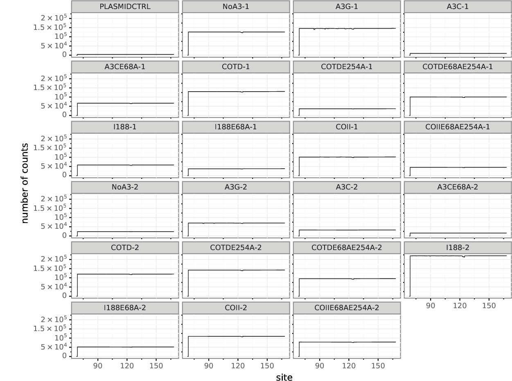
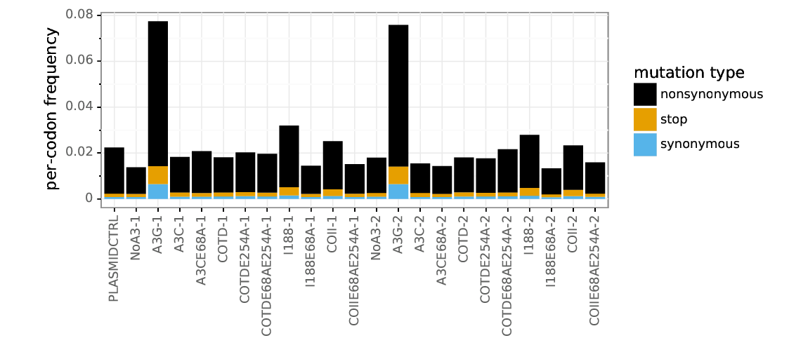
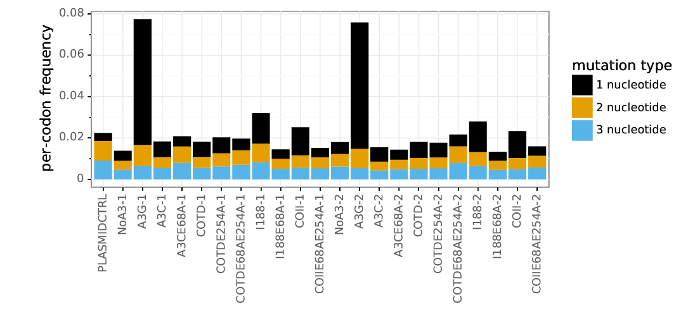
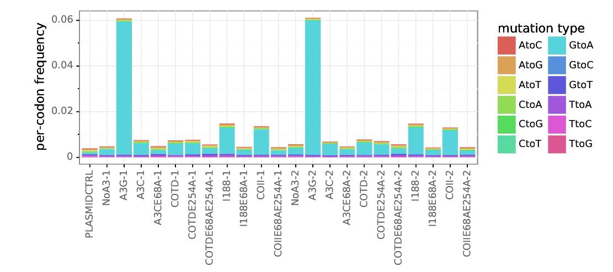

# Super restriction factor hypermutation analysis
### Adam S. Dingens
### In collabortation with Mollie McDonnell and Michael Emerman

Analysis performed by Adam Dingens in the [Bloom lab](http://research.fhcrc.org/bloom/en.html) in early 2019. Cell culture experiments performed by Mollie McDonnell, and sequencing prep performed by Mollie with Adam's guidance.

## Import `Python` modules, define widely used functions
Set `use_existing` to `yes` below if you want to use any existing output, and `no` if you want to re-generate all output.


```python

```


```python

```


```python
import os
import glob
%matplotlib inline
import pandas as pd
from IPython.display import display, HTML
import dms_tools2
import dms_tools2.plot
import dms_tools2.sra
import dms_tools2.utils
import dms_tools2.diffsel
import dms_tools2.prefs
from dms_tools2.ipython_utils import showPDF
import rpy2
import rpy2.robjects 
import dms_tools2.rplot
import string
import Bio.SeqIO
import Bio.Seq
import Bio.SeqRecord
import numpy as np
import pylab as plt

print("Using dms_tools2 version {0}".format(dms_tools2.__version__))

# results will go in this directory
resultsdir = './results_1and1b/' 
if not os.path.isdir(resultsdir):
    os.mkdir(resultsdir)
    
# CPUs to use, -1 means all available
ncpus = 14

# do we use existing results or generate everything new?
use_existing = "yes"
```

    Using dms_tools2 version 2.5.1


# Download the sequencing data from the Sequence Read Archive
UPDATE LATER

samples = pd.DataFrame.from_records(
#new data published here for 1-18
        [('BG505_mut_virus_rep3d_1-18-4ug','SRR10014244'),
         ('BG505_mut_virus_rep3d_1-18-8ug','SRR10014243'),
         ('BG505_mut_virus_rep2d_1-18-4ug','SRR10014242'),
         ('BG505_mut_virus_rep2d_1-18-8ug','SRR10014241'),
         ('BG505_mut_virus_rep2d','SRR10014240'),
         ('BG505_mut_virus_rep3d','SRR10014239'),
#Data on VRC01 and 3BNC117 from Dingens et al Immunity 2019 
#Here, I do not download the data on 10-1074 and pooled 10-1074/3BNC117. While I look at this data briefly for one analysis, I simply download the analyzed files from github rather than redoing all analyses. However these can be downloaded and anaylzed in parallel by uncommentin the relevant lines below. 
         ('BG505_mut-virus-rep1b','SRR7693968'),
         ('BG505_mut-virus-rep2b-3BNC117-4ug','SRR7693969'),
         ('BG505_mut-virus-rep1-VRC01-11ug','SRR7693971'),

         ('BG505_mut-virus-rep3','SRR7693976'),
         ('BG505_mut-virus-rep3-3BNC117-1-1ug','SRR7693977'),
         ('BG505_mut-DNA-rep1','SRR7693986'),
         ('BG505_mut-DNA-rep3','SRR7694021'),
         ('BG505_mut-virus-rep2b','SRR7694018'),
         ('BG505_wt-DNA-rep3','SRR7694017'),
         ('BG505_mut-virus-rep2-VRC01-8ug','SRR7694015'),

         ('BG505_mut-virus-rep1b-3BNC117-4ug','SRR7694006'),
         ('BG505_mut-virus-rep3b-3BNC117-4ug','SRR7694005'),
         ('BG505_mut-virus-rep3b','SRR7694003'),
         ('BG505_mut-DNA-rep2','SRR7694002'),
         ('BG505_wt-DNA-rep2','SRR7693998'),
         ('BG505_mut-virus-rep2','SRR7693997'),
         ('BG505_mut-virus-rep3-VRC01-tr2-11ug','SRR7693996'),
         ('BG505_mut-virus-rep3-VRC01-11ug','SRR7693992'),
         ('BG505_mut-virus-rep2-VRC01-11ug','SRR7693991'),
         ('BG505_mut-virus-rep2b-3BNC117-3ug','SRR7693990'),
         ('BG505_wt-DNA-rep1','SRR7693989'),
         ('BG505_mut-virus-rep1','SRR7693987')],
        columns=['name', 'run']
        )


fastqdir = './results/FASTQ_files/'
if not os.path.isdir(fastqdir):
    os.mkdir(fastqdir)
print("Downloading FASTQ files from the SRA...")
dms_tools2.sra.fastqFromSRA(
        samples=samples,
        fastq_dump='fastq-dump', # valid path to this program on the Hutch server
        fastqdir=fastqdir,
        aspera=(
            '/app/aspera-connect/3.5.1/bin/ascp', # valid path to ascp on Hutch server
            '/app/aspera-connect/3.5.1/etc/asperaweb_id_dsa.openssh' # Aspera key on Hutch server
            ),
        )
print("Here are the names of the downloaded files now found in {0}".format(fastqdir))
display(HTML(samples.to_html(index=False)))

## Define samples from FASTQ_files

R1fastqfilelist_df = pd.read_csv("./data/samples.csv", header =0)
display(HTML(R1fastqfilelist_df.to_html(index=False)))


```python
samplenames = ["PLASMIDCTRL", "NoA3_1", "A3G_1", "A3C_1", "A3CE68A_1", "COTD_1", "COTDE254A_1", "COTDE68AE254A_1", "I188_1", "I188E68A_1", "COII_1", "COIIE68AE254A_1", "NoA3_2", "A3G_2", "A3C_2", "A3CE68A_2", "COTD_2", "COTDE254A_2", "COTDE68AE254A_2", "I188_2", "I188E68A_2", "COII_2", "COIIE68AE254A_2"]
R1_df = pd.DataFrame({'name':samplenames})

R1_df["name"] = R1_df['name'].str.replace("_", "-")
R1_df["R1"] = R1_df['name'].astype(str) + "_R1.fastq.gz"
print(R1_df)
```

                   name                           R1
    0       PLASMIDCTRL      PLASMIDCTRL_R1.fastq.gz
    1            NoA3-1           NoA3-1_R1.fastq.gz
    2             A3G-1            A3G-1_R1.fastq.gz
    3             A3C-1            A3C-1_R1.fastq.gz
    4         A3CE68A-1        A3CE68A-1_R1.fastq.gz
    5            COTD-1           COTD-1_R1.fastq.gz
    6       COTDE254A-1      COTDE254A-1_R1.fastq.gz
    7   COTDE68AE254A-1  COTDE68AE254A-1_R1.fastq.gz
    8            I188-1           I188-1_R1.fastq.gz
    9        I188E68A-1       I188E68A-1_R1.fastq.gz
    10           COII-1           COII-1_R1.fastq.gz
    11  COIIE68AE254A-1  COIIE68AE254A-1_R1.fastq.gz
    12           NoA3-2           NoA3-2_R1.fastq.gz
    13            A3G-2            A3G-2_R1.fastq.gz
    14            A3C-2            A3C-2_R1.fastq.gz
    15        A3CE68A-2        A3CE68A-2_R1.fastq.gz
    16           COTD-2           COTD-2_R1.fastq.gz
    17      COTDE254A-2      COTDE254A-2_R1.fastq.gz
    18  COTDE68AE254A-2  COTDE68AE254A-2_R1.fastq.gz
    19           I188-2           I188-2_R1.fastq.gz
    20       I188E68A-2       I188E68A-2_R1.fastq.gz
    21           COII-2           COII-2_R1.fastq.gz
    22  COIIE68AE254A-2  COIIE68AE254A-2_R1.fastq.gz


## Process the FASTQ files to count the mutations for each sample
We used [barcoded-subamplicon](https://jbloomlab.github.io/dms_tools2/bcsubamp.html) sequencing to obtain high accuracy during the Illumina deep sequencing. We therefore use the [dms2_batch_bcsubamp](https://jbloomlab.github.io/dms_tools2/dms2_batch_bcsubamp.html#dms2-batch-bcsubamp) program to analyze these data.

Running that program requires specifying a `--batchfile` that lists the samples, a wildtype `--refseq` to which we make alignments, and --alignspecs that tell us where the subamplicons should align. 
The batch file that we specify is printed by the cell below. The alignment specs need to be exactly correct for the subamplicons to align. We also do some trimming of the reads using the `--R1trim` and `--R2trim` parameters. 

The wildtype sequence of the BG505.W6.C2.T332N Env used in this experiment is in the file [./data/BG505.W6.C2.T332N_env.fasta](./data/BG505.W6.C2.T332N_env.fasta).
This sequence is based on GenBank accession number [DQ208458.1](https://www.ncbi.nlm.nih.gov/nucleotide/77025198?report=genbank&log$=nuclalign&blast_rank=1&RID=WMZ5XNUG014), with the introduced T332N mutation to knock in the glycan commonly targeted by this class of bnAbs. 


```python
!pwd

```

    /fh/fast/bloom_j/computational_notebooks/adingens/2019/SuperRes_Hypermut


```python
#first, initial fastqdir ='../../../../SR/ngs/illumina/bloom_lab/190913_M03100_0478_000000000-CKT45/Data/Intensities/'
#these are in: "./FASTQ_files_initialMiseqOnly/"

#then the post rnd2 samples were repooled and sequenced again. These additional reads can thus simple be added to the existing reads. I did this by concatenating all reads from both runs into single fastq files, putting them in the same fastq file
#second miseq to be added with initial miseq run. These are in:
fastqdir = "./FASTQ_files/"


#Mollie also redid rnd2? and resquenced. These read CANNOT be added to the above reads before error correction, as molecules were tagged in spereate PCR rxns?
#however, in the future, the error corrected mutation counts could be summed together and then analyzed. 
#For now, I put these reads in a seperate fastqdir:
#miseq run: 191104_M04866_0302_000000000-CNB5P
#these are in: "./FASTQ_files_exp2/"

```


```python
refseq = './data/Bru_Pol.fasta'

# define subamplicon alignment specifications
alignspecs = ' '.join(['204,504,34,34']) #these need to be updated 179,529,25,25


# counts and alignments placed in this directory
countsdir = os.path.join(resultsdir, 'codoncounts')
if not os.path.isdir(countsdir):
    os.mkdir(countsdir)
    
# write sample information to a batch file for dms2_batch_bcsubamplicons
countsbatchfile = os.path.join(countsdir, 'batch.csv')
print("Here is the batch file that we write to CSV format to use as input:")
display(HTML(R1_df[['name', 'R1']].to_html(index=False)))
R1_df[['name', 'R1']].to_csv(countsbatchfile, index=False)

#we will only look at sites sequenced
sitemaskfile = "./data/sitemask.csv"

#here, we need to allow for a large number of mismatches if the sequence was in fact hypermutated
print('\nNow running dms2_batch_bcsubamp...')
log = !dms2_batch_bcsubamp \
        --batchfile {countsbatchfile} \
        --refseq {refseq} \
        --alignspecs {alignspecs} \
        --outdir {countsdir} \
        --summaryprefix summary \
        --R1trim 200 \
        --R2trim 170 \
        --minq 15 \
        --fastqdir {fastqdir} \
        --maxmuts 100 \
        --sitemask {sitemaskfile} \
        --ncpus {ncpus} \
        --use_existing {use_existing} 
print("Completed dms2_batch_bcsubamp.")

# need to edit


```

    Here is the batch file that we write to CSV format to use as input:


<table border="1" class="dataframe">
  <thead>
    <tr style="text-align: right;">
      <th>name</th>
      <th>R1</th>
    </tr>
  </thead>
  <tbody>
    <tr>
      <td>PLASMIDCTRL</td>
      <td>PLASMIDCTRL_R1.fastq.gz</td>
    </tr>
    <tr>
      <td>NoA3-1</td>
      <td>NoA3-1_R1.fastq.gz</td>
    </tr>
    <tr>
      <td>A3G-1</td>
      <td>A3G-1_R1.fastq.gz</td>
    </tr>
    <tr>
      <td>A3C-1</td>
      <td>A3C-1_R1.fastq.gz</td>
    </tr>
    <tr>
      <td>A3CE68A-1</td>
      <td>A3CE68A-1_R1.fastq.gz</td>
    </tr>
    <tr>
      <td>COTD-1</td>
      <td>COTD-1_R1.fastq.gz</td>
    </tr>
    <tr>
      <td>COTDE254A-1</td>
      <td>COTDE254A-1_R1.fastq.gz</td>
    </tr>
    <tr>
      <td>COTDE68AE254A-1</td>
      <td>COTDE68AE254A-1_R1.fastq.gz</td>
    </tr>
    <tr>
      <td>I188-1</td>
      <td>I188-1_R1.fastq.gz</td>
    </tr>
    <tr>
      <td>I188E68A-1</td>
      <td>I188E68A-1_R1.fastq.gz</td>
    </tr>
    <tr>
      <td>COII-1</td>
      <td>COII-1_R1.fastq.gz</td>
    </tr>
    <tr>
      <td>COIIE68AE254A-1</td>
      <td>COIIE68AE254A-1_R1.fastq.gz</td>
    </tr>
    <tr>
      <td>NoA3-2</td>
      <td>NoA3-2_R1.fastq.gz</td>
    </tr>
    <tr>
      <td>A3G-2</td>
      <td>A3G-2_R1.fastq.gz</td>
    </tr>
    <tr>
      <td>A3C-2</td>
      <td>A3C-2_R1.fastq.gz</td>
    </tr>
    <tr>
      <td>A3CE68A-2</td>
      <td>A3CE68A-2_R1.fastq.gz</td>
    </tr>
    <tr>
      <td>COTD-2</td>
      <td>COTD-2_R1.fastq.gz</td>
    </tr>
    <tr>
      <td>COTDE254A-2</td>
      <td>COTDE254A-2_R1.fastq.gz</td>
    </tr>
    <tr>
      <td>COTDE68AE254A-2</td>
      <td>COTDE68AE254A-2_R1.fastq.gz</td>
    </tr>
    <tr>
      <td>I188-2</td>
      <td>I188-2_R1.fastq.gz</td>
    </tr>
    <tr>
      <td>I188E68A-2</td>
      <td>I188E68A-2_R1.fastq.gz</td>
    </tr>
    <tr>
      <td>COII-2</td>
      <td>COII-2_R1.fastq.gz</td>
    </tr>
    <tr>
      <td>COIIE68AE254A-2</td>
      <td>COIIE68AE254A-2_R1.fastq.gz</td>
    </tr>
  </tbody>
</table>


    
    Now running dms2_batch_bcsubamp...
    Completed dms2_batch_bcsubamp.


Now we look at the summary plots created by `dms2_batch_bcsubamp`. 
All of these files are found in the directory specified by --outdir, and with the prefix specified by summaryprefix. 
So we define them using this plot prefix plus the suffix for each plot.
Note that these files all refer to sites in sequential 1, 2, ... numbering of the BF520 sequence.


```python
countsplotprefix = os.path.join(countsdir, 'summary')
```

The `*_readstats.pdf` plot below shows the statistics on the reads. This plot shows that most of the reads were retained, and a small fraction discarded because of low-quality barcodes. None failed the Illumina filter as those were already filtered out those when we downloaded from the SRA.


```python
showPDF(countsplotprefix + '_readstats.pdf', width=600)
```





The `*_readsperbc.pdf` plot below shows how many times different barcodes were observed for each sample. Barcodes need to be observed multiple times to be useful for barcoded-subamplicon sequencing error correction.


```python
showPDF(countsplotprefix + '_readsperbc.pdf')
```





The `*_bcstats.pdf` plot below shows statistics on the barcodes. Some of the barcodes had to be discarded because they had too few reads (these are the single-read barcodes in the plot above), a small fraction with adequate reads were not alignable, and the rest aligned to the Env gene properly.
This plot and the one above suggest that probably could have gotten additional depth by sequencing more, since then we would have had more barcodes with multiple reads.


```python
showPDF(countsplotprefix + '_bcstats.pdf', width=600)
```





The `*_depth.pdf` plot below shows the depth (number of called codons) at each site in the gene. 
For most of the samples, the depth across the gene is fairly uniform, indicating that the subamplicons were pooled fairly evenly.  
Note that some samples (in particular the mock samples) were intentionally sequenced to higher depth than the antibody-selected samples, as we expect to see more diversity in the mock samples. 
Note that the gene was not sequenced past codon site 691, and so there is no coverage there.


```python
showPDF(countsplotprefix + '_depth.pdf')
```





The `*_mutfreq.pdf` plot below shows the per-codon frequency of mutations at each site. 
For each antibody-selected sample, we see a few sites of clear peaks in mutation frequency. 
These peaks tend to occur at the same sites in different replicates, and so presumably represent the sites where antibody-escape mutations are selected. 
There are no such peaks for the mock sample since there is no antibody selection to favor specific mutations.
Note also that the gene was not mutagenized or sequenced past codon site 691, so there are no mutations there.


```python
showPDF(countsplotprefix + '_mutfreq.pdf')
```


The `*_codonmuttypes.pdf` plot below shows the per-codon frequency of nonsynonymous, synonymous, and stop codon mutations across the entire gene. 


```python
showPDF(countsplotprefix + '_codonmuttypes.pdf', width=600)
```





The `*_codonntchanges.pdf` plot below shows same data as above but categorizes codon mutations by the number of nucleotides that are changed (e.g., ATG to AAG changes 1 nucleotide, ATG to AAC changes 2 nucleotides, and ATG to CAC changes 3 nucleotides).


```python
showPDF(countsplotprefix + '_codonntchanges.pdf', width=600)
```





The `*_singlentchanges.pdf` plot below shows the frequency of each type of nucleotide change among only codon mutations with one nucleotide change. This plot is mostly useful to check if there is a large bias in which mutations appear. In particular, if you are getting oxidative damage (which causes G to T mutations) during the library preparation process, you will see a large excess of C to A or G to T mutations (or both). There is not much oxidative damage in the samples plotted below, which mostly have a fairly even distribution of nucleotide changes.

We do see that transitions (G <-> A and C <-> T) are a bit more common than most of the other types of mutations (all of which are transversions). This is expected, since [PCR based sources of mutations are expected to preferentially introduce transitions](https://www.ncbi.nlm.nih.gov/pmc/articles/PMC3720931/). 

This plot would also be important to examine any sign of APOBEC hypermutation (also G <-> A, with preferences for specific motifs) occuring in the HIV genome. One of the reasons we selected the SupT1.R5 cell line was because [there is very little of the APOBEC proteins expressed in  a subclone of SupT1 cells](https://www.ncbi.nlm.nih.gov/pubmed/20308164). In the viral samples, there does appear to be an increase in G to A and C to T mutations. However, we passaged WT virus in these cells and confirmed there were not signs of extensive APOBEC hypermutation in hotspot motifs via deep sequencing of env after passaging. Thus, we do not think there is extensive APOBEC hypermutation in our data, and this increase certain types of mutations in the viral samples is likely due to bias in the viral reverse transcription.


```python
showPDF(countsplotprefix + '_singlentchanges.pdf', width=600)
```





```python

```


```python

```


```python

```


```python

```

## Renumber codon counts to HXB2 numbering 
The standard numbering scheme for HIV Env is the [HXB2 numbering scheme](https://www.hiv.lanl.gov/content/sequence/HIV/REVIEWS/HXB2.html).
The file [./data/BF520c2_to_HXB2.csv](./data/BF520c2_to_HXB2.csv) gives the mapping from sequential 1, 2, ... numbering of the BF520 protein sequence to the HXB2 numbering scheme. 
This file was generated by aligning the HXB2 sequence [taken from Genbank](http://www.ncbi.nlm.nih.gov/protein/1906385) with the BF520c2 sequence using the [LANL alignment interface](http://www.hiv.lanl.gov/cgi-bin/VIRALIGN/viralign.cgi) at the protein sequence level. 
Insertions relative to HXB2 are given letter suffixes as [described here](http://www.hiv.lanl.gov/content/sequence/HIV/REVIEWS/HXB2.html).

Additionally, not all residues in BF520 Env were mutagenized. 
The N-terminal signal peptide and the C-terminal cytoplasmic tail were excluded because they seem likely to affect expression level. 
These sites are not listed in the renumbering file, and so are dropped when we do the re-numbering.

To do the re-numbering, we use the [dms_tools2.utils.renumberSites](https://jbloomlab.github.io/dms_tools2/dms_tools2.utils.html#dms_tools2.utils.renumberSites) function from the [dms_tools Python API](https://jbloomlab.github.io/dms_tools2/api.html) to create a new directory that contains all of the re-numbered files with the same name as in the original codon counts directory produced above.


```python
renumberedcountsdir = os.path.join(resultsdir, 'renumberedcounts')
```


```python
renumberfile = os.path.join(resultsdir, '/HXB2_numbering/BG505_to_HXB2.csv')

# renumbered counts will go here
renumberedcountsdir = os.path.join(resultsdir, 'renumberedcounts')

# counts files to renumber
countsfiles = glob.glob('{0}/*codoncounts.csv'.format(countsdir))

dms_tools2.utils.renumberSites(renumberfile, countsfiles, missing='drop', 
        outdir=renumberedcountsdir)
```

## Compute the fraction surviving 
Now we compute the [fraction surviving](https://jbloomlab.github.io/dms_tools2/fracsurvive.html).This caluclation takes into account the level of antibody selection, found in the input file below. We will use mutliple different controls to estimate the error rates to  correct fo, and put the output in its own subdirectory, named according to its control sample. 

This [csv file](/data/BG505_qPCR_master.csv) contains the fraction remaining infectivity for each antibody selected sample, as quatified using pol qPCR and computed based on a standard curve of infecting cells with dilutions of mutant virus (library and experiment specific), with dilutiuons ranging from 0.1 to .0001. 

We first create a batch file to use with [dms2_batch_fracsurvive](https://jbloomlab.github.io/dms_tools2/dms2_batch_fracsurvive.html). 
Note we make the **group** argument the antibody, the **name** argument the replicate, and assign the **sel**, **mock**, and **err** arguments based on the names used for the batch file when generating the counts files above with `dms2_batch_bcsubamp`.
By grouping replicates for the same antibody in the batch file, we tell [dms2_batch_fracsurvive](https://jbloomlab.github.io/dms_tools2/dms2_batch_fracsurvive.html) to analyze these together and take their mean and median.

### Average fraction surviving across multiple antibody dilutions
For select antibodies, we have escape profiles at numerous dilutions. Oftentimes, the antibody concentrations are quite similar (e.g. 3 vs 4 ug/mL), and the single replicate escape profiles look very similar as well. I am averaging across these additional dilutions. 


```python
fracsurvivedir = os.path.join(resultsdir, 'fracsurvive')
if not os.path.isdir(fracsurvivedir):
    os.mkdir(fracsurvivedir)
    
fracsurviveaboveavgdir = os.path.join(resultsdir, 'fracsurviveaboveavg')
if not os.path.isdir(fracsurviveaboveavgdir):
    os.mkdir(fracsurviveaboveavgdir) 
```


```python
fracsurvivebatchavg = pd.read_csv("./data/118_VRC01_3BNC117_avgconcentrations_fracsurvive.csv", header =0)
fracsurvivebatchavg = fracsurvivebatchavg.sort_values(by='group')
display(HTML(fracsurvivebatchavg.to_html(index=False)))
```


<table border="1" class="dataframe">
  <thead>
    <tr style="text-align: right;">
      <th>group</th>
      <th>name</th>
      <th>sel</th>
      <th>mock</th>
      <th>err</th>
      <th>mds_names</th>
      <th>libfracsurvive</th>
    </tr>
  </thead>
  <tbody>
    <tr>
      <td>118</td>
      <td>4ug-rep2d</td>
      <td>mut-virus-rep2d-118-4ug</td>
      <td>mut-virus-rep2d</td>
      <td>wt-DNA-rep2</td>
      <td>118-4ug-rep2d</td>
      <td>0.005177</td>
    </tr>
    <tr>
      <td>118</td>
      <td>8ug-rep2d</td>
      <td>mut-virus-rep2d-118-8ug</td>
      <td>mut-virus-rep2d</td>
      <td>wt-DNA-rep2</td>
      <td>118-8ug-rep2d</td>
      <td>0.000168</td>
    </tr>
    <tr>
      <td>118</td>
      <td>4ug-rep3d</td>
      <td>mut-virus-rep3d-118-4ug</td>
      <td>mut-virus-rep3d</td>
      <td>wt-DNA-rep3</td>
      <td>118-4ug-rep3d</td>
      <td>0.005182</td>
    </tr>
    <tr>
      <td>118</td>
      <td>8ug-rep3d</td>
      <td>mut-virus-rep3d-118-8ug</td>
      <td>mut-virus-rep3d</td>
      <td>wt-DNA-rep3</td>
      <td>118-8ug-rep3d</td>
      <td>0.000673</td>
    </tr>
    <tr>
      <td>3BNC117</td>
      <td>3ug-rep2b</td>
      <td>mut-virus-rep2b-3BNC117-3ug</td>
      <td>mut-virus-rep2b</td>
      <td>wt-DNA-rep2</td>
      <td>3BNC117-3ug-rep2b</td>
      <td>0.009847</td>
    </tr>
    <tr>
      <td>3BNC117</td>
      <td>4ug-rep2b</td>
      <td>mut-virus-rep2b-3BNC117-4ug</td>
      <td>mut-virus-rep2b</td>
      <td>wt-DNA-rep2</td>
      <td>3BNC117-4ug-rep2b</td>
      <td>0.022027</td>
    </tr>
    <tr>
      <td>3BNC117</td>
      <td>4ug-rep3b</td>
      <td>mut-virus-rep3b-3BNC117-4ug</td>
      <td>mut-virus-rep3b</td>
      <td>wt-DNA-rep3</td>
      <td>3BNC117-4ug-rep3b</td>
      <td>0.006475</td>
    </tr>
    <tr>
      <td>3BNC117</td>
      <td>4ug-rep1b</td>
      <td>mut-virus-rep1b-3BNC117-4ug</td>
      <td>mut-virus-rep1b</td>
      <td>wt-DNA-rep1</td>
      <td>3BNC117-4ug-rep1b</td>
      <td>0.008765</td>
    </tr>
    <tr>
      <td>VRC01</td>
      <td>11ug-rep1</td>
      <td>mut-virus-rep1-VRC01-11ug</td>
      <td>mut-virus-rep1</td>
      <td>wt-DNA-rep1</td>
      <td>VRC01-11ug-rep1</td>
      <td>0.002029</td>
    </tr>
    <tr>
      <td>VRC01</td>
      <td>11ug-rep3</td>
      <td>mut-virus-rep3-VRC01-11ug</td>
      <td>mut-virus-rep3</td>
      <td>wt-DNA-rep3</td>
      <td>VRC01-11ug-rep3</td>
      <td>0.007226</td>
    </tr>
    <tr>
      <td>VRC01</td>
      <td>11ug-rep3-tr2</td>
      <td>mut-virus-rep3-VRC01-tr2-11ug</td>
      <td>mut-virus-rep3</td>
      <td>wt-DNA-rep3</td>
      <td>VRC01-11ug-rep3-tr2</td>
      <td>0.001008</td>
    </tr>
    <tr>
      <td>VRC01</td>
      <td>11ug-rep2</td>
      <td>mut-virus-rep2-VRC01-11ug</td>
      <td>mut-virus-rep2</td>
      <td>wt-DNA-rep2</td>
      <td>VRC01-11ug-rep2</td>
      <td>0.009827</td>
    </tr>
    <tr>
      <td>VRC01</td>
      <td>8ug-rep2</td>
      <td>mut-virus-rep2-VRC01-8ug</td>
      <td>mut-virus-rep2</td>
      <td>wt-DNA-rep2</td>
      <td>VRC01-8ug-rep2</td>
      <td>0.027775</td>
    </tr>
  </tbody>
</table>


```python
fracsurvivebatchavgcopy = fracsurvivebatchavg.copy()


names = fracsurvivebatchavg["group"].astype(str) + "-" + fracsurvivebatchavg["name"].astype(str)
names = names.tolist()
```

We now `run dms2_batch_survive` twice with the following difference:
    1. First we run it simply computing the fraction surviving for each mutation.
    2. Then we run it with the --aboveavg yes option to compute the fraction surviving for each mutation above the overall library average.

Note how the results for these two different runs are output to two different subdirectories.


```python
fracsurvivebatch = fracsurvivebatchavg.copy()
fracsurvivebatchfile = os.path.join(fracsurvivedir, 'batch.csv')
print("Here is the batch input that we write to the CSV file {0}:".format(fracsurvivebatchfile))
display(HTML(fracsurvivebatch.to_html(index=False)))
fracsurvivebatch.to_csv(fracsurvivebatchfile, index=False, encoding='utf-8')


for (arg_aboveavg, outdir) in [('', fracsurvivedir), ('--aboveavg yes', fracsurviveaboveavgdir)]:
    print("\nRunning dms2_batch_fracsurvive {0}and writing output to {1}".format(
            {'':'', '--aboveavg yes':'with `--aboveavg yes` '}[arg_aboveavg], outdir))
    log = !dms2_batch_fracsurvive \
            --summaryprefix summary \
            --batchfile {fracsurvivebatchfile} \
            --outdir {outdir} \
            --indir {renumberedcountsdir} \
            --use_existing {use_existing} \
            {arg_aboveavg} 
    print("Completed run.")
```

    Here is the batch input that we write to the CSV file ./results/fracsurvive/batch.csv:


<table border="1" class="dataframe">
  <thead>
    <tr style="text-align: right;">
      <th>group</th>
      <th>name</th>
      <th>sel</th>
      <th>mock</th>
      <th>err</th>
      <th>mds_names</th>
      <th>libfracsurvive</th>
    </tr>
  </thead>
  <tbody>
    <tr>
      <td>118</td>
      <td>4ug-rep2d</td>
      <td>mut-virus-rep2d-118-4ug</td>
      <td>mut-virus-rep2d</td>
      <td>wt-DNA-rep2</td>
      <td>118-4ug-rep2d</td>
      <td>0.005177</td>
    </tr>
    <tr>
      <td>118</td>
      <td>8ug-rep2d</td>
      <td>mut-virus-rep2d-118-8ug</td>
      <td>mut-virus-rep2d</td>
      <td>wt-DNA-rep2</td>
      <td>118-8ug-rep2d</td>
      <td>0.000168</td>
    </tr>
    <tr>
      <td>118</td>
      <td>4ug-rep3d</td>
      <td>mut-virus-rep3d-118-4ug</td>
      <td>mut-virus-rep3d</td>
      <td>wt-DNA-rep3</td>
      <td>118-4ug-rep3d</td>
      <td>0.005182</td>
    </tr>
    <tr>
      <td>118</td>
      <td>8ug-rep3d</td>
      <td>mut-virus-rep3d-118-8ug</td>
      <td>mut-virus-rep3d</td>
      <td>wt-DNA-rep3</td>
      <td>118-8ug-rep3d</td>
      <td>0.000673</td>
    </tr>
    <tr>
      <td>3BNC117</td>
      <td>3ug-rep2b</td>
      <td>mut-virus-rep2b-3BNC117-3ug</td>
      <td>mut-virus-rep2b</td>
      <td>wt-DNA-rep2</td>
      <td>3BNC117-3ug-rep2b</td>
      <td>0.009847</td>
    </tr>
    <tr>
      <td>3BNC117</td>
      <td>4ug-rep2b</td>
      <td>mut-virus-rep2b-3BNC117-4ug</td>
      <td>mut-virus-rep2b</td>
      <td>wt-DNA-rep2</td>
      <td>3BNC117-4ug-rep2b</td>
      <td>0.022027</td>
    </tr>
    <tr>
      <td>3BNC117</td>
      <td>4ug-rep3b</td>
      <td>mut-virus-rep3b-3BNC117-4ug</td>
      <td>mut-virus-rep3b</td>
      <td>wt-DNA-rep3</td>
      <td>3BNC117-4ug-rep3b</td>
      <td>0.006475</td>
    </tr>
    <tr>
      <td>3BNC117</td>
      <td>4ug-rep1b</td>
      <td>mut-virus-rep1b-3BNC117-4ug</td>
      <td>mut-virus-rep1b</td>
      <td>wt-DNA-rep1</td>
      <td>3BNC117-4ug-rep1b</td>
      <td>0.008765</td>
    </tr>
    <tr>
      <td>VRC01</td>
      <td>11ug-rep1</td>
      <td>mut-virus-rep1-VRC01-11ug</td>
      <td>mut-virus-rep1</td>
      <td>wt-DNA-rep1</td>
      <td>VRC01-11ug-rep1</td>
      <td>0.002029</td>
    </tr>
    <tr>
      <td>VRC01</td>
      <td>11ug-rep3</td>
      <td>mut-virus-rep3-VRC01-11ug</td>
      <td>mut-virus-rep3</td>
      <td>wt-DNA-rep3</td>
      <td>VRC01-11ug-rep3</td>
      <td>0.007226</td>
    </tr>
    <tr>
      <td>VRC01</td>
      <td>11ug-rep3-tr2</td>
      <td>mut-virus-rep3-VRC01-tr2-11ug</td>
      <td>mut-virus-rep3</td>
      <td>wt-DNA-rep3</td>
      <td>VRC01-11ug-rep3-tr2</td>
      <td>0.001008</td>
    </tr>
    <tr>
      <td>VRC01</td>
      <td>11ug-rep2</td>
      <td>mut-virus-rep2-VRC01-11ug</td>
      <td>mut-virus-rep2</td>
      <td>wt-DNA-rep2</td>
      <td>VRC01-11ug-rep2</td>
      <td>0.009827</td>
    </tr>
    <tr>
      <td>VRC01</td>
      <td>8ug-rep2</td>
      <td>mut-virus-rep2-VRC01-8ug</td>
      <td>mut-virus-rep2</td>
      <td>wt-DNA-rep2</td>
      <td>VRC01-8ug-rep2</td>
      <td>0.027775</td>
    </tr>
  </tbody>
</table>


    
    Running dms2_batch_fracsurvive and writing output to ./results/fracsurvive
    Completed run.
    
    Running dms2_batch_fracsurvive with `--aboveavg yes` and writing output to ./results/fracsurviveaboveavg
    Completed run.


Running [dms2_batch_fracsurvive](https://jbloomlab.github.io/dms_tools2/dms2_batch_fracsurvive.html) creates plots showing how the fraction surviving estimates correlate among replicates. 
These plots have names like `summary_*-avgfracsurvivecorr.pdf` and `summary_*-maxfracsurvivecorr.pdf`. 
Note that the plots show the correlations between all pairs, and also on the diagonal show the density of the different selection values for each replicates (most of them are close to zero).


```python
fracsurviveprefix = os.path.join(fracsurvivedir, 'summary_')
groups = fracsurvivebatchavg['group'].unique()

```


```python
for seltype in ['avgfracsurvive', 'maxfracsurvive']:
    print("\n{0} correlations:".format(seltype))
    plots = []
    for g in groups:
        plot = fracsurviveprefix + g + '-' + seltype + 'corr.pdf'
        if os.path.isfile(plot):
            plots.append(plot)
        else:
            print("{0} does not exist.".format(plot))
    showPDF(plots, width=1800)
```

    
    avgfracsurvive correlations:


    
    maxfracsurvive correlations:


Next, we can look at the correlation for the `fraction surviving above average` values.
